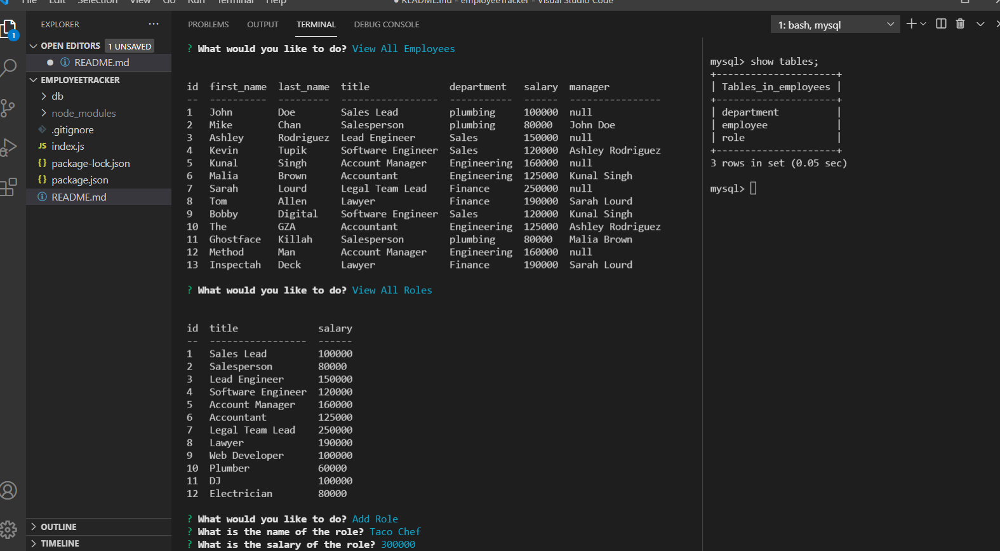

# employeeTracker

## Table of Contents
- [Overview](#overview)
- [Installation](#installation)
- [Screenshot and link to demo](#screenshot-and-link-to-demo)
- [Questions](#questions)

## Overview
Developers are often tasked with creating interfaces that make it easy for non-developers to view and interact with information stored in databases. Often these interfaces are known as Content Management Systems. In this homework assignment, your challenge is to architect and build a solution for managing a company's employees using node, inquirer, and MySQL.

## Installation
npm i

## Screenshot and link to demo

[Demo Link](https://drive.google.com/file/d/1ocp25VucYiX8Wzrr3QLeXRjU0CjjmHnH/view)

## Questions
If you have any questions, please refer to my Github page, [JamieKaczor](https://github.com/JamieKaczor), or contact me through my email, Dignanjk@aol.com